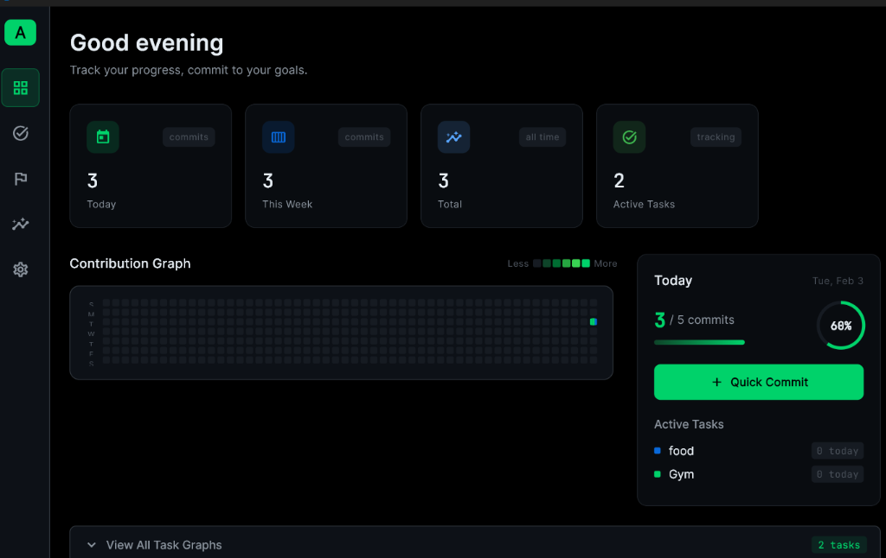
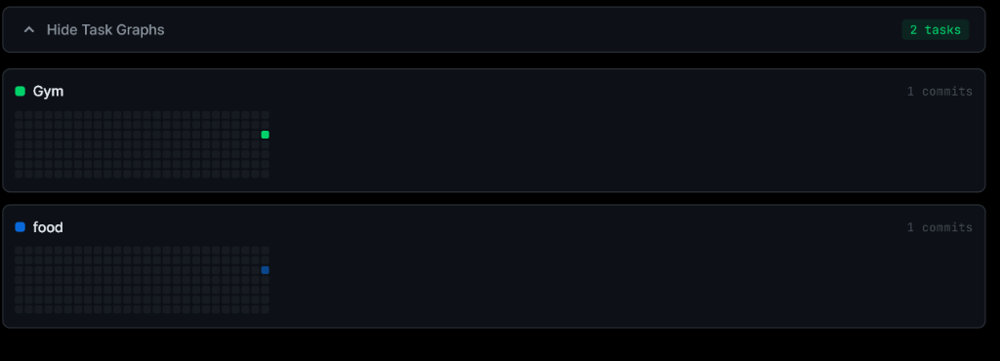
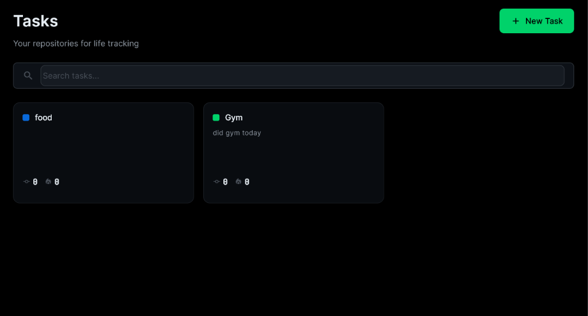

<div align="center">

# 🌿 Arvion

**A beautiful, GitHub-style contribution tracker for your life**

[](https://flutter.dev)
[](https://dart.dev)
[](LICENSE)
[](https://www.microsoft.com/windows)

*Track anything. Visualize everything. Commit to your goals.*

</div>

---

## ✨ Features

<table>
<tr>
<td width="50%">

### 📊 **Contribution Heatmap**
GitHub-style visualization of your daily progress with beautiful animations and multi-color support for different tasks.

### 🎯 **Task Tracking**
Create color-coded tasks to track any habit, goal, or project. Each task gets its own contribution graph.

### ⚡ **Quick Commits**
Log your progress with one click. Choose intensity levels (1-5) to show how much effort you put in.

### 🤖 **AI Assistant**
Powered by Google Gemini with full CRUD capabilities - create, list, update, and delete tasks via natural language.

</td>
<td width="50%">

### 📈 **Per-Task Graphs**
View individual heatmaps for each task, showing exactly when and how much you worked on each goal.

### ⏱️ **Screen Time Tracking**
Automatic monitoring of app usage and screen time with idle detection. Track productivity patterns effortlessly.

### 🔄 **Auto-Commit**
Background verification service automatically logs commits when you use tracked applications (Windows only).

### 🎨 **Premium Dark Theme**
Sleek, modern interface designed for focus and productivity with glassmorphism effects.

### ⌨️ **Keyboard First**
Command palette (Ctrl+K) for quick navigation and actions. Designed for power users.

</td>
</tr>
</table>

---

## 📸 Screenshots

### Dashboard

*Main dashboard with contribution graph, daily summary, and quick commit button*

### Per-Task Graphs

*Individual heatmaps for each task with their own colors*

### Task Management

*Create and manage your life repositories*

---

## 🚀 Getting Started

### Prerequisites

- [Flutter SDK](https://flutter.dev/docs/get-started/install) 3.0+
- Windows 10/11 (for Windows build)
- Visual Studio 2022 with C++ workload (for Windows build)

### Installation

1. **Clone the repository**
   ```bash
   git clone https://github.com/yourusername/arvion.git
   cd arvion
   ```

2. **Install dependencies**
   ```bash
   flutter pub get
   ```

3. **Run the app**
   ```bash
   flutter run -d windows
   ```

### Building for Production

```bash
flutter build windows --release
```

The built executable will be in `build/windows/x64/runner/Release/`.

---

## 🏗️ Architecture

```
lib/
├── core/               # Theme, constants, utilities
│   ├── theme/          # Colors, typography, theme data
│   └── constants/      # App-wide constants
├── data/               # Data layer
│   ├── models/         # Isar database models
│   ├── database/       # Database initialization
│   └── repositories/   # Data access patterns
├── features/           # Feature modules
│   ├── dashboard/      # Main dashboard with heatmap
│   ├── tasks/          # Task management
│   └── settings/       # App settings
├── providers/          # Riverpod state management
└── widgets/            # Shared UI components
```

### Tech Stack

| Layer | Technology |
|-------|------------|
| **Framework** | Flutter 3.x |
| **State Management** | Riverpod |
| **Database** | Isar (embedded NoSQL) |
| **AI** | Google Gemini API |
| **Platform APIs** | Win32 (Windows) |
| **UI Components** | Custom widgets with glassmorphism |
| **Platform** | Windows (macOS/Linux coming soon) |

---

## ⌨️ Keyboard Shortcuts

| Shortcut | Action |
|----------|--------|
| `Ctrl + K` | Open command palette |
| `Escape` | Close dialogs/overlay |
| `Ctrl + N` | Create new task |

---

## 🛣️ Roadmap

- [x] Core dashboard with heatmap
- [x] Task creation and management
- [x] Quick commit functionality
- [x] Per-task contribution graphs
- [x] Multi-color heatmap cells
- [x] AI Assistant with full CRUD (Gemini API)
- [x] Screen time tracking
- [x] Auto-commit via app usage monitoring
- [x] Protocols (daily/weekly routines)
- [x] Insights & analytics
- [x] Data export (JSON/CSV)
- [ ] Cloud sync
- [ ] macOS support
- [ ] Linux support
- [ ] Mobile apps (iOS/Android)

---

## 🤝 Contributing

We love contributions! Please see our [Contributing Guide](CONTRIBUTING.md) for details.

1. Fork the repository
2. Create your feature branch (`git checkout -b feature/amazing-feature`)
3. Commit your changes (`git commit -m 'Add amazing feature'`)
4. Push to the branch (`git push origin feature/amazing-feature`)
5. Open a Pull Request

---

## 📄 License

This project is licensed under the MIT License - see the [LICENSE](LICENSE) file for details.

---

## 🙏 Acknowledgments

- Inspired by GitHub's contribution graph
- Built with [Flutter](https://flutter.dev) and [Riverpod](https://riverpod.dev)
- Database powered by [Isar](https://isar.dev)

---

<div align="center">

**Made with 💚 for productivity enthusiasts**

[Report Bug](https://github.com/yourusername/arvion/issues) · [Request Feature](https://github.com/yourusername/arvion/issues)

</div>
